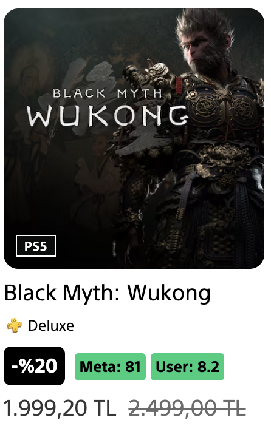
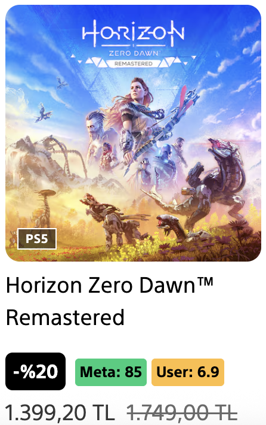
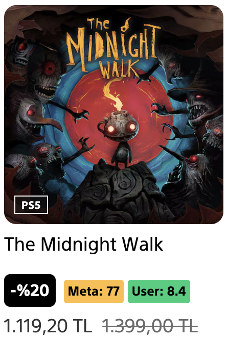

# PS Store Metacritic Extension

A cross-browser web extension that displays Metacritic scores on PlayStation Store game pages.

## Features

- ✅ Automatically detects PlayStation Store game listings
- 🎯 Adds Metacritic scores next to discount badges
- 🎨 Color-coded scores (Green 79+, Yellow 50-79, Red 0-49)
- ⚡ Real-time injection as pages load
- 🔄 Works with dynamically loaded content

## Installation

### Chrome/Edge
1. Open Chrome/Edge and go to `chrome://extensions/` or `edge://extensions/`
2. Enable "Developer mode"  
3. Click "Load unpacked"
4. Select this extension folder

### Firefox
1. Open Firefox and go to `about:debugging`
2. Click "This Firefox"
3. Click "Load Temporary Add-on"
4. Select the `manifest.json` file

## Current Implementation

- Game names show games that are "vanilla"

## Screenshots

Here are examples of the extension in action on the PlayStation Store:

### Black Myth: Wukong
<br>
*Shows Meta: 81 and User: 8.2 scores alongside the discount badge*

### Horizon Zero Dawn™ Remastered
<br>
*Displays Meta: 85 and User: 6.9 scores with the game listing*

### The Midnight Walk
<br>
*Features Meta: 77 and User: 8.4 scores integrated with the store interface*

## How it Works

1. The extension scans PlayStation Store pages for game tiles
2. Extracts game names from product tiles
3. Matches games with known Metacritic scores
4. Injects score badges next to discount information
5. Monitors for dynamic content changes

## Files Structure

```
├── manifest.json     # Extension configuration
├── content.js       # Main injection script
├── styles.css       # Score badge styling
├── popup.html       # Extension popup interface
└── README.md        # This file
```
